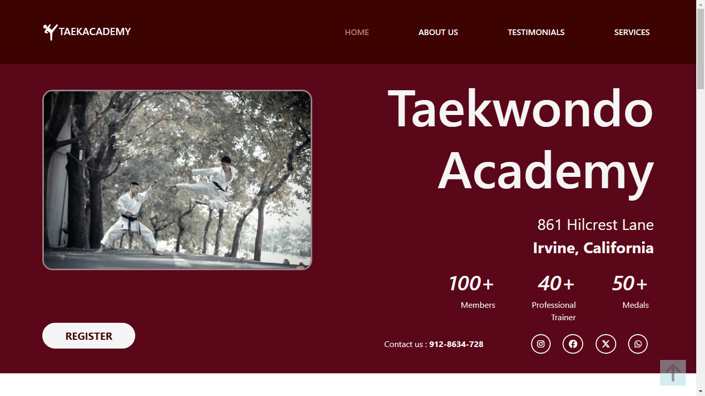

# Project - Zen Travel

This is a Taekwondo Academy website. Made using HTML, CSS, Bootstrap. Totally Responsive design.

## Table of contents

- [Overview](#overview)
  - [The challenge](#the-challenge)
  - [Screenshot](#screenshot)
  - [Links](#links)
- [My process](#my-process)
  - [Built with](#built-with)
  - [What I learned](#what-i-learned)
  - [Continued development](#continued-development)
- [Author](#author)

## Overview

### The challenge

Make a clean design and also visually appealing. Making the website responsive for Mobile and Tablet screens.

### Screenshot

### Links

- Solution URL: [https://github.com/webdevsuman/tkd-academy](https://github.com/webdevsuman/tkd-academy)
- Live Site URL: [https://webdevsuman.github.io/tkd-academy](https://webdevsuman.github.io/tkd-academy)

## My process

Step 1 - Make a structure of a section. eg.- navbar or hero section
Step 2 - Apply CSS and Bootstrap
Step 3 - Make it responsive for Mobile and Tablet screens
Step 4 - Go to the next section and Repeat from Step 1.
End - Connect the Hyperlinks, Add Favicon and commit to the GitHub.
Post End - ReadMe file add and commit to git.

### Built with

-Semantic HTML5 markup
-CSS custom properties
-Flexbox
-Bootstrap grid, Carousel, Navs & Tabs, Forms
-AOS
-Media query
-Fontawesome icons
-Favicon

### What I learned

Sometimes Bootstrap by default adds margin with negative unit for some components, which when viewed from a Mobile screen shows Alignment Problems. We have to manually adjust it through Inline CSS or External CSS with "!important" value.

### Continued development

Any Suggestions?

## Author

- Website - [Suman Das](https://github.com/webdevsuman/)
